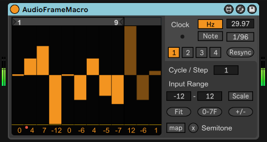
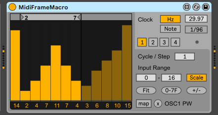

# Audio Frame Macro / MIDI Frame Macro

## What is this?
A series of Max fro Live devices to modulate parameters in integer values and PAL/NTSC like interlace frame rates.
Deeply influenced by tracker software and chiptune plugins.

### Features
- Designed to modulate integer parameters such as semitone, octave, and waveform types in instrument devices or plugins.
- Also able to modulate float-value parameters by scaled values.
- 4 parameters can be mapped to individual modulations, which sync to the master clock of the device.

## Download
https://maxforlive.com/library/device/6678/audio-frame-macro 
https://maxforlive.com/library/device/6763/midi-frame-macro 
see [Releases](https://github.com/h1data/M4L-frameMacro/releases) section for older version

## Parameters
- `ClockMode` Switches the clock rate in Hz or note-related.
- `ClockFrequency` Adjusts the clock frequency in Hz. 
Actual speed is doubled to simulate interlaced frames. 29.97Hz: NTSC, 25Hz: PAL.
- `CLockRate` Adjusts the clock rate with note-related speed.
- `ParameterSelector` (below Clock): Switches from 4 individual parameter macros.
- `Resync` (Audio Frame Macro only) When pressed, reset all current position of parameter macros to sync again. 
Pressing the button always makes an undo history of Live. 
TIP: Setting automation to Resync makes attack effect without MIDI input. 

belows are included in each individual parameter macro.
- `Loop Selector` (above sliders): Adjusts the loop position.
- `Sliders` Adjust each modulation value per frame.
- `Values` (below sliders): Indicate each modulation value. Able to adjust and be automated. 
The value can exceed Input Range, but the actual modulation value does not.
- `Cycle / Step` Adjusts the number of cycles needed to proceed with each steps. Larger steps make slower progress.
- `Input Range`: Adjusts the minimum/maximum value of each sliders.
- `Scale` When enabled, the device scales modulation value to the range of modulated parameters.
Suitable for parameters in float.
- `Fit` When pressed, fits the values of Input Range to the range of modulated parameter.
Suitable for parameters in integer. Available only when the parameter for modulation is mapped.
- `0-7F` When pressed, sets input range to [0, 127 (0x7F)].
Unavailable when the parameter without number is mapped. (on/off or enumerations)
- `+/-` When pressed, sets input range to [-64, 63]. Suitable for bipolar parameters such as pan.
Unavailable when the parameter without number is mapped. (on/off or enumerations)
- `Map` When pressed, activates mapping mode. You can click a mappable parameter in Live to select as the mapped parameter to modulate.
The mapped parameter name is displayed in right of Unmap button (x).
- `Unmap` (x) When pressed, cancel the mapping of parameter.

## Known Issues
see [Issues](https://github.com/h1data/M4L-frameMacro/issues?q=)
